# Progetto Programmazione Avanzata 23/24

# Indice
1. [Obiettivo di Progetto](#obiettivo-del-progetto)
2. [Progettazione](#progettazione)
   - [Diagrammi UML](#diagrammi-uml)
     - [Diagramma dei Casi d'Uso](#diagramma-dei-casi-duso)
     - [Diagrammi delle Sequenze](#diagrammi-delle-sequenze)
3. [Diagramma ER](#digramma-er)
4. [Pattern Utilizzati](#pattern-utilizzati)
5. [Avvio del Progetto](#avvio-del-progetto)
     - [Prerequisiti](#prerequisiti)
     - [Configurazione](#configurazione)
6. [Routes](#routes)
7. [Test del Progetto](#test-del-progetto)
8. [Riconoscimenti](#riconoscimenti)


# Obiettivo di Progetto

Il progetto consiste nella realizzazione di un back-end per un sistema di gioco della dama. L'obiettivo è permettere a un utente autenticato (con JWT) di giocare partite di dama contro un altro giocatore o contro un'intelligenza artificiale (IA). Le funzionalità principali includono:

- **Gestione delle partite:** Creazione di partite contro un avversario umano o IA, con livelli di difficoltà selezionabili. Il sistema consente la gestione di più partite attive simultaneamente, limitando ogni utente a partecipare a una sola partita alla volta.
- **Timeout e abbandono:** Se un utente non esegue una mossa entro un intervallo di tempo prestabilito, la partita viene considerata abbandonata.
- **Token di pagamento:** Ogni partita richiede l'addebito di token per la creazione e per ogni mossa effettuata. Il credito dell'utente viene verificato prima dell'inizio della partita e aggiornato durante il gioco.
- **Rotte API:** Creazione di API per eseguire mosse, verificare lo stato della partita, visualizzare partite passate e lo storico delle mosse, con possibilità di esportazione in JSON o PDF.
- **Classifica giocatori:** Fornitura di una classifica pubblica che mostra il punteggio dei giocatori, con opzioni di ordinamento.
- **Certificato di vittoria:** Generazione di un certificato PDF per le partite vinte, contenente informazioni come il tempo di gioco e il numero di mosse.
- **Gestione utenti:** Implementazione di una rotta amministrativa per ricaricare i token di un utente autenticato tramite email.

Le specifiche prevedono l'utilizzo di TypeScript, JWT per l'autenticazione, un database relazionale con Sequelize, e Docker per l'avvio e la gestione dei servizi del progetto.

# Progettazione 

La progettazione del sistema di gioco della dama è stata sviluppata per garantire una struttura solida e modulare, sfruttando principi di progettazione orientata agli oggetti e best practice di architettura software. L’obiettivo principale è stato quello di creare un sistema scalabile e manutenibile, che consenta un'esperienza di gioco fluida e sicura, assicurando al contempo un facile accesso e gestione delle risorse per gli utenti. 

Di seguito viene riportata la struttura della directory:

```
.
├── Dockerfile
├── README.md
├── docker-compose.yml
├── entrypoint.sh
├── package-lock.json
├── package.json
├── src
│   ├── app.ts
│   ├── controllers
│   │   ├── adminController.ts
│   │   ├── authController.ts
│   │   ├── gameController.ts
│   │   └── moveController.ts
│   ├── db
│   │   ├── config.js
│   │   ├── database.js
│   │   ├── migrations
│   │   │   ├── 20241022103228-table_player.js
│   │   │   ├── 20241022104353-table_game.js
│   │   │   └── 20241022105609-table_move.js
│   │   └── seeders
│   │       ├── 20241022114823-seeder_player.js
│   │       ├── 20241022141815-seeder-game.js
│   │       └── 20241022141822-seeder-move.js
│   ├── express.d.ts
│   ├── factories
│   │   ├── authFactory.ts
│   │   ├── errorHandler.ts
│   │   ├── gameFactory.ts
│   │   ├── moveFactory.ts
│   │   └── tokenFactory.ts
│   ├── initialBoard.json
│   ├── middleware
│   │   ├── adminAuthMiddleware.ts
│   │   └── authMiddleware.ts
│   ├── models
│   │   ├── Game.ts
│   │   ├── Move.ts
│   │   └── Player.ts
│   ├── routes
│   │   ├── adminRoute.ts
│   │   ├── authRoute.ts
│   │   ├── gameRoute.ts
│   │   └── moveRoute.ts
│   ├── services
│   │   ├── gameService.ts
│   │   └── moveService.ts
│   └── utils
│       └── cryptoUtils.ts
├── tsconfig.json
└── wait-for-it.sh

```

Per raggiungere questo scopo, sono stati realizzati diversi diagrammi UML che illustrano i casi d’uso e il flusso delle principali operazioni, come la creazione e gestione delle partite, l’esecuzione delle mosse e la generazione dei certificati di vittoria. Inoltre, sono stati adottati design pattern specifici per risolvere problemi comuni in modo efficiente, con particolare attenzione alla separazione delle responsabilità tra le varie componenti del sistema.

Di seguito vengono descritti i principali diagrammi e pattern utilizzati, spiegandone l'implementazione e la scelta in relazione alle necessità del progetto.

## Diagrammi UML

### Diagramma dei Casi d'Uso
Il diagramma dei casi d'uso è uno strumento essenziale per illustrare le interazioni tra gli attori, ovvero gli utenti, e il sistema stesso. In questo progetto, i casi d'uso delineano le principali funzionalità che il sistema mette a disposizione degli utenti, mettendo in evidenza le azioni che possono essere eseguite all'interno del sistema di gestione delle partite di dama.

Grazie al diagramma dei casi d'uso, è possibile ottenere una panoramica generale delle operazioni disponibili per gli utenti. Sono identificati quattro attori: Utente Pubblico, Giocatore, Amministratore e AI, ognuno dei quali interagisce con il sistema attraverso funzioni specifiche. Di seguito verrà presentato il diagramma dei casi d'uso:

```mermaid
graph TD
    PublicUser["Public User"] --> playersRanking["playersRanking"]
    PublicUser --> login["login"]

    Player["Player"] --> createGame["createGame"]
    Player --> executeMove["executeMove"]
    Player --> getMoveHistory["getMoveHistory"]
    Player --> abandonGame["abandonGame"]
    Player --> evaluateGame["evaluateGame"]
    Player --> getGameDetails["getGameDetails"]
    Player --> exportToPDF["exportToPDF"]
    Player --> getVictoryCertify["getVictoryCertify"]
    Player --> getMatchList["getMatchList"]

    Admin["Admin"] --> createGame["createGame"]
    Admin --> executeMove["executeMove"]
    Admin --> getMoveHistory["getMoveHistory"]
    Admin --> abandonGame["abandonGame"]
    Admin --> evaluateGame["evaluateGame"]
    Admin --> getGameDetails["getGameDetails"]
    Admin --> exportToPDF["exportToPDF"]
    Admin --> getVictoryCertify["getVictoryCertify"]
    Admin --> getMatchList["getMatchList"]
    Admin --> RechargeUserTokens["Recharge User Tokens"]

    AI["AI"] --> executeAiMove["executeAiMove"]

    System["System"] --> GenerateJSONFile["Generate JSON File"]
    System --> GeneratePDF["exportToPDF"]
    System --> CheckForGameEnd["Check For Game End"]
    System --> VerifyMoveValidity["Verify Move Validity"]
    System --> UpdateGameStatus["Update Game Status"]
    System --> UpdatePlayerPoints["Update Player Points"]
    System --> removeCredits["removeCredits"]

    createGame --> authenticateJWT["authenticateJWT"]
    executeMove --> authenticateJWT["authenticateJWT"]
    getMoveHistory --> authenticateJWT["authenticateJWT"]
    abandonGame --> authenticateJWT["authenticateJWT"]
    evaluateGame --> authenticateJWT["authenticateJWT"]
    getGameDetails --> authenticateJWT["authenticateJWT"]
    exportToPDF --> authenticateJWT["authenticateJWT"]
    getVictoryCertify --> authenticateJWT["authenticateJWT"]
    getMatchList --> authenticateJWT["authenticateJWT"]
    RechargeUserTokens --> authenticateJWT["authenticateJWT"]

    playersRanking --> SortPlayerRankings["Sort Player Rankings"]
    exportToPDF --> FilterGamesByDate["Filter Games By Date"]
    abandonGame --> UpdatePlayerPoints
```




### Diagrammi delle Sequenze
#### POST '/login'
Il diagramma di sequenza per la rotta di login descrive il flusso di interazione tra un utente e il sistema durante il processo di autenticazione. Quando l'utente invia le proprie credenziali, il sistema verifica l'email e la password. Se le informazioni sono corrette, viene generato un token JWT, che consente all'utente di accedere alle funzionalità protette. In caso contrario, il sistema restituisce un messaggio di errore, garantendo così la sicurezza dell'applicazione. Questo diagramma evidenzia i passaggi chiave e le decisioni critiche nella gestione dell'autenticazione.

#### POST '/create/new-game'
Il diagramma di sequenza per la rotta di create game rappresenta il flusso di interazioni durante il processo di creazione di una nuova partita nel sistema di gestione delle partite. Illustra come l'utente interagisce con il middleware di autenticazione, il controller delle partite e il servizio di gioco per finalizzare la richiesta. Questo diagramma è utile per comprendere i passaggi chiave e le responsabilità di ciascun componente.

#### POST '/new-move'
Il diagramma delle sequenze per il modulo di gestione delle mosse nel gioco illustra il flusso delle interazioni tra l'utente, il middleware di autenticazione, il controller delle mosse e il servizio di movimento. Inizia con l'utente che invia una richiesta per eseguire una mossa, passando attraverso il controllo dell'autenticazione JWT. Se autenticato, il controller gestisce la richiesta e delega la logica di esecuzione della mossa al servizio di movimento. Questo diagramma è essenziale per comprendere le dinamiche di interazione e il processo di gestione delle mosse nel sistema di gioco.


# Diagramma ER
Il diagramma ER (Entity-Relationship) offre una rappresentazione visiva delle entità coinvolte nel sistema e delle loro relazioni. In questo progetto, il diagramma illustra come i modelli Player, Game e Move interagiscono tra loro. Le entità rappresentano le diverse componenti del sistema, come i giocatori e le partite, mentre le relazioni mostrano come queste entità si collegano, ad esempio, attraverso le mosse effettuate dai giocatori in una partita. Questo diagramma è utile per comprendere la struttura dei dati e la logica sottostante dell'applicazione.


# Pattern Utilizzati
Per strutturare e organizzare il progetto, sono stati adottati diversi design pattern, ciascuno con uno scopo specifico che aiuta a risolvere le sfide principali dell'applicazione, come la separazione delle responsabilità, la gestione dei dati e la modularità del codice. Di seguito sono descritti i principali pattern utilizzati:

## Model-View-Controller-Service (MVCS) 
Questo pattern estende il tradizionale modello MVC, aggiungendo un livello di servizio per gestire la logica di business. Con MVCS, i controller gestiscono esclusivamente la comunicazione tra l'interfaccia utente, non presente nel progetto in esame, e la logica del sistema, delegando ai servizi la gestione delle operazioni più complesse, rendendo il codice più modulare e facilmente manutenibile. 

- **Model:** I modelli sono implementati tramite Sequelize, un ORM per JavaScript/TypeScript, che permette di mappare le entità del database come Giocatore, Partita e Mossa. Questi modelli definiscono la struttura dei dati e le operazioni di persistenza, gestendo lo stato e l'integrazione diretta con il database. Il modello rappresenta il cuore della gestione dei dati, garantendo che la logica di accesso al database rimanga separata dalla logica di business.
- **Controller:** I controller ricevono le richieste HTTP e coordinano le operazioni tra le varie componenti, gestendo principalmente il flusso delle operazioni e smistando le richieste ai servizi nei casi più complessi. Tuttavia, non sempre è stata applicata una netta separazione tra controller e servizi: per le situazioni più semplici, abbiamo adottato un pattern MVC tradizionale, mantenendo la logica di business direttamente nei controller. Nei casi più complessi, come la gestione delle partite e delle mosse, abbiamo invece introdotto uno strato di Service per incapsulare e gestire la logica di business in modo più modulare.
- **Service:** Lo strato dei servizi è stato implementato solo dove necessario, per gestire le operazioni più complesse legate alla logica di business, come la creazione di partite, la gestione delle mosse e l’aggiornamento dei punteggi. Nei servizi viene centralizzata la logica aziendale, consentendo una separazione chiara dai controller, che restano concentrati sulla gestione delle richieste e delle risposte HTTP. Questa divisione ha permesso di semplificare il codice nelle parti più intricate dell’applicazione, mantenendo il sistema organizzato e facile da manutenere.

## Data Access Object (DAO)
Il pattern DAO (Data Access Object) è una struttura progettuale che serve a isolare la logica di accesso al database dal resto dell'applicazione. In un’applicazione organizzata secondo questo pattern, tutte le operazioni di creazione, lettura, aggiornamento e cancellazione (CRUD) sono centralizzate in un livello dedicato, costituito da classi o moduli specifici che interagiscono con il database.

## Chain of Responsibility (COR)
Il pattern Chain of Responsibility è stato implementato nel nostro progetto per gestire in modo efficace la logica di autenticazione e la gestione degli errori attraverso middleware dedicati. Ad esempio, abbiamo sviluppato un middleware di autenticazione che verifica se l'utente è autenticato tramite JWT. Se l'utente non è autenticato, il middleware interrompe il flusso della richiesta e restituisce un messaggio di errore personalizzato, impedendo l'accesso a risorse riservate. Questo approccio non solo semplifica la logica di controllo dell'accesso, ma consente di gestire in modo centralizzato la validazione dell'autenticazione. Inoltre, abbiamo implementato un middleware per la gestione degli errori, che si attiva quando viene riscontrato un errore durante l'elaborazione della richiesta. Questo middleware genera messaggi di errore personalizzati che forniscono feedback chiaro all'utente, migliorando l'esperienza utente e garantendo una gestione uniforme delle eccezioni nel sistema. In questo modo, il pattern Chain of Responsibility consente di mantenere il codice ben organizzato e facilmente manutenibile.

## Factory
La gestione degli errori è centralizzata tramite un file chiamato HerrorEndler, responsabile di lanciare gli errori in modo coerente e strutturato. Per ogni macro area (auth, game, move, e token), abbiamo creato una Factory di errori dedicata, che facilita la generazione di errori specifici per ciascun contesto applicativo.

Ogni Factory fornisce un’interfaccia unificata per la creazione degli errori HTTP personalizzati, consentendo la generazione di errori come `NOT_FOUND`, `UNAUTHORIZED`, `FORBIDDEN` e altri, in base alla situazione. Questo approccio ha diversi vantaggi:

- **Centralizzazione della gestione degli errori:** Il file HerrorEndler, combinato con le Factory di errore per ogni area, riduce la ripetizione del codice e semplifica la creazione di messaggi di errore personalizzati.
- **Uniformità nei codici di stato HTTP:** Utilizzando una libreria come http-status-codes, le Factory possono associare facilmente i codici HTTP appropriati agli errori, garantendo una gestione standardizzata delle eccezioni.
- **Estensibilità:** Le Factory per **auth**, **game**, **move** e **token** rendono il sistema di gestione degli errori flessibile, consentendo di aggiungere nuovi tipi di errori o modificare quelli esistenti senza intervenire in ogni singola area del codice.

# Avvio del Progetto
## Prerequisiti
- Docker
- Docker-compose

## Configurazione
1. Clonare il repository:
   
```
git clone 
cd ProgrammazioneAvanzata2024
```

# Riconoscimenti
Il progetto è stato realizzato da Alessio Capriotti (Matricola: 1118918) e Andrea Marini (Matricola: 1118778), che hanno unito le loro competenze e conoscenze per sviluppare un sistema di gioco innovativo. Attraverso un lavoro di squadra e una stretta collaborazione, hanno affrontato le sfide del progetto, contribuendo a ciascuna fase dello sviluppo con dedizione e attenzione ai dettagli. La sinergia tra i due ha giocato un ruolo fondamentale nel raggiungimento degli obiettivi prefissati.
    
   
